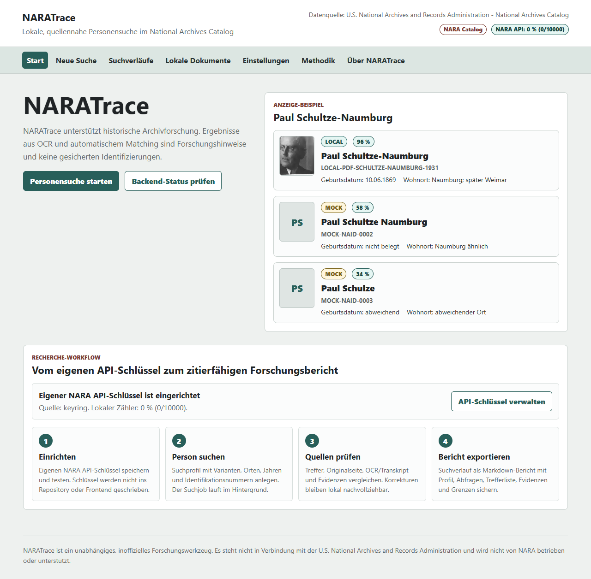
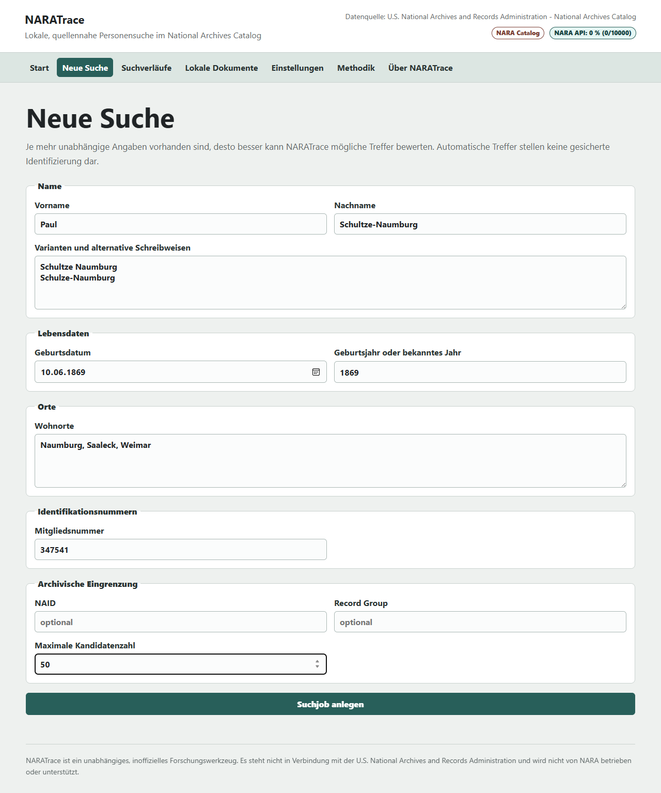
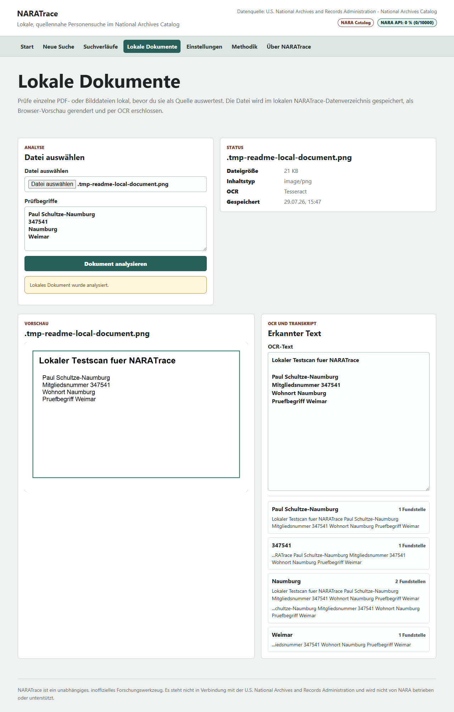
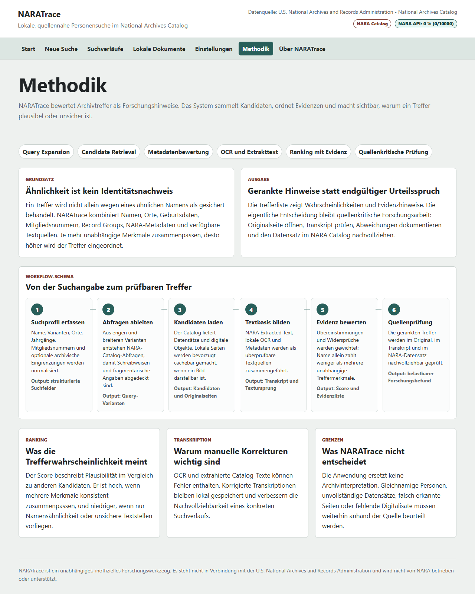
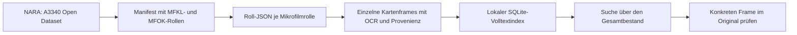

# NARATrace

> **Vom Namen zur überprüfbaren Karte.** NARATrace unterstützt historische Recherche in digitalisierten NARA-Beständen – lokal, nachvollziehbar und mit dem Original immer im Blick.



Lokale, quellennahe Personensuche und Dokumentprüfung für historische Arbeit mit dem National Archives Catalog.

NARATrace ist ein unabhängiges, inoffizielles Forschungswerkzeug für digitalisierte Bestände der U.S. National Archives and Records Administration (NARA). Die Anwendung läuft lokal auf dem Rechner des Benutzers. Es gibt kein Cloud-Backend, keine Telemetrie und kein GitHub-Pages-Deployment.

Automatische Treffer sind Forschungshinweise und keine gesicherten Identifizierungen.

## Für die historische Recherche

Eine Namenssuche ist noch kein Personenbeweis. NARATrace hilft dabei, die Arbeit zwischen erstem Hinweis und quellenkritischer Prüfung zu organisieren: Suchvarianten festhalten, mögliche Kartenframes eingrenzen, OCR-Text mit dem Original vergleichen und die Gründe für oder gegen eine Zuordnung dokumentieren.

| Im Mittelpunkt | Was NARATrace dazu beiträgt |
| --- | --- |
| **Personen und Namen** | Varianten, Schreibweisen, Lebensdaten, Orte und Mitgliedsnummern werden als Suchprofil festgehalten. |
| **Archivische Herkunft** | Treffer bleiben mit Rolle, Frame, NARA-Quelle und Fundkontext verbunden. |
| **Quellenkritik** | Evidenzhinweise und Widersprüche machen eine Zuordnung prüfbar statt nur plausibel. |
| **Eigene Arbeitsunterlagen** | Lokale PDFs und Bilder können separat erschlossen werden, ohne sie mit NARA-Treffern zu verwechseln. |

Maßgeblich bleiben die Originalkarte, ihr archivischer Kontext und eine nachvollziehbare Prüfung durch Forschende.

### Ein möglicher Arbeitsgang

1. **Frage formulieren:** Welche Person, welcher Ort, welches Datum oder welche Mitgliedsnummer wird gesucht?
2. **Spuren vergleichen:** NARATrace sucht in den verfügbaren Beschreibungen und Texten nach passenden Kartenframes.
3. **Am Original prüfen:** Bildseite, Transkript, Rolle und Frame werden nebeneinander gelesen – nicht nur ein Score.
4. **Ergebnis festhalten:** Recherchebericht, Suchprofil und Evidenz ermöglichen die spätere Nachprüfung.

### Einstieg nach Interesse

- Für die Arbeit mit der Anwendung: [Nutzeranleitung](docs/USER-GUIDE.md)
- Für Nachvollziehbarkeit und Grenzen: [Suchmethodik](docs/SEARCH-METHODOLOGY.md)
- Für Bestand, Rolle und Frame: [NARA- und A3340-Datenarchitektur](docs/NARA_Architekture.md)
- Für die technische Umsetzung: [TRAXER-Programmarchitektur](docs/TRAXER_Architekture.md)

## Arbeitsansichten

### Startseite und Anzeige-Beispiel

Die Startseite zeigt direkt eine kompakte Demo-Trefferliste mit Quellenbadge, Trefferwahrscheinlichkeit und Personenfakten.
Neue Nutzer sehen dort außerdem den Forschungsworkflow vom eigenen API-Schlüssel bis zum exportierbaren Recherchebericht.

### Neue Suche

Das Suchformular erfasst Namen, Varianten, Lebensdaten, Orte, Mitgliedsnummern und archivische Eingrenzungen. Suchjobs laufen im Hintergrund, zeigen Fortschritt und können abgebrochen werden.



### Lokale Dokumente

Lokale PDF-, Bild- und TIFF-Dateien können lokal analysiert werden. NARATrace erzeugt eine Browser-Vorschau, führt OCR aus und markiert Prüfbegriffe mit Fundstellen.



### Methodik

Der Methodik-Reiter erklärt den Workflow von Suchprofil über Kandidatenabruf und OCR bis zur quellenkritischen Prüfung.



## Was die Anwendung für die Forschungsarbeit bereithält

- Recherche und Arbeitsdaten bleiben auf dem eigenen Rechner
- NARA-Suche mit einem lokal verwahrten persönlichen API-Schlüssel
- Längere Suchläufe zeigen Fortschritt, Laufzeit, Restzeit und Abbruchmöglichkeit
- gerankte Trefferlisten mit Evidenzhinweisen
- Suchverläufe mit lokal gespeicherten Treffern
- Dekadenübersicht für datierbare Treffer eines Suchlaufs
- Markdown-Rechercheberichte mit Suchprofil, Abfragen, Treffer- und Evidenzdokumentation
- Original- und Medienansicht mit Mehrseiten-Navigation, Zoom und Transkriptkorrektur
- Lokale Dokumentprüfung für PDF-, Bild- und Scanmaterial
- OCR-Fundstellen als Hilfe beim Lesen und Gegenprüfen, nicht als Ersatz für das Original
- Methodikseite mit Workflow-Schema und Grenzen der automatischen Bewertung

## Quellenbasis

Datenquelle ist die U.S. National Archives and Records Administration - National Archives Catalog.

NARATrace verwendet die National Archives Catalog API v2, sobald ein persönlicher API-Schlüssel gespeichert ist. Echte Suchergebnisse dürfen nicht erfunden werden. Demo- und Mock-Daten sind ausdrücklich gekennzeichnet.

Die offizielle API-Dokumentation liegt unter:

```text
https://catalog.archives.gov/api/v2/api-docs/
```

Einen API-Schlüssel fordert man laut NARA über `Catalog_API@nara.gov` an.

---

## Technik und lokaler Betrieb

Dieser Abschnitt richtet sich an Personen, die NARATrace selbst installieren, betreiben oder weiterentwickeln möchten.

### Lokaler Start

Voraussetzungen:

- Python 3.11 oder neuer
- Node.js 22 oder neuer
- Tesseract OCR, wenn lokale OCR genutzt werden soll

Backend installieren:

```powershell
python -m pip install -e .\backend[test]
```

Frontend bauen:

```powershell
cd frontend
npm install
npm run build
cd ..
```

### TypeScript-Frontend und TextMarker-Viewer

Das Frontend wird strikt mit TypeScript geprüft. Neben Tests und Produktionsbuild steht dafür zur Verfügung:

```powershell
cd frontend
npm run check
```

Für die interaktive Transkriptansicht verwendet NARATrace die öffentlichen Web-Component-APIs von `TS_TextMarkerCore` und `TS_TextMarkerViewer`. In diesem Arbeitsbereich sind sie als lokale `file:`-Abhängigkeiten vorgesehen. Vor `npm install` müssen die beiden Schwester-Repositories neben `NARA-Trace` vorhanden sein; der Viewer wird mit seinem eigenen `justfile` gebaut:

```powershell
cd ..\TS_TextMarkerViewer
just build
cd ..\NARA-Trace\frontend
npm install
```

Die große PDF-Engine des Viewers wird erst geladen, wenn eine Detailansicht geöffnet wird. Sie ergänzt die vorhandene Originalbildansicht; OCR und Originalquelle bleiben unverändert.

Anwendung starten:

```powershell
python -m naratrace
```

Der Server bindet standardmäßig nur an `127.0.0.1` und verwendet Port `8765`.

Falls der Port belegt ist:

```powershell
python -m naratrace --port 8766
```

Ohne Browserstart:

```powershell
python -m naratrace --no-browser
```

Windows-Schnellstart:

```powershell
.\quickstart.bat
```

Das Batch-Skript baut das Frontend und startet NARATrace auf Port `8766`. Läuft dort bereits NARATrace, öffnet es diese Instanz statt mit einem Portfehler abzubrechen. Ist der Port durch einen anderen Dienst belegt, wählt es den nächsten freien lokalen Port bis `8776`. Für die vollständige A3340-Suche zuerst einmalig beziehungsweise nach einem Abbruch fortsetzbar ausführen:

```powershell
.\quickstart.bat index
```

Mit einem Befehl indizieren und starten:

```powershell
.\quickstart.bat all
```

Der Index enthält die Roll-JSON-Texte aller MFKL-/MFOK-Rollen, aber keine Massenkopie der Kartenbilder.

### Was beim ersten A3340-Durchlauf passiert

Eine *Roll* ist eine digitalisierte Mikrofilmrolle und damit ein archivischer Container. NARATrace liest zu jeder Rolle die von NARA veröffentlichte JSON-Beschreibung, übernimmt den OCR-Text und die Fundstellen der einzelnen Kartenframes in einen lokalen Volltextindex und behält die Herkunft jedes Treffers bei. Die Kartenbilder selbst bleiben bei NARA und werden nur für konkrete Treffer abgerufen.



MFKL ist die alphabetisch geführte Zentralkartei und der zentrale Einstieg für Namensrecherchen. MFOK ist die Ortsgruppenkartei und kann einen unabhängigen lokalen bzw. geografischen Bezug liefern. Ein Suchtreffer ist stets ein Hinweis: Name, Frame, Rolle und Originalquelle müssen quellenkritisch geprüft werden. Die ausführliche historische und technische Einordnung steht in [docs/NARA_Architekture.md](docs/NARA_Architekture.md).

### Indexgeschwindigkeit und kontrollierte Parallelität

Der erste Indexaufbau lädt die Roll-JSONs eines großen Bestands aus dem Netz und kann deshalb je nach Verbindung dauern. NARATrace verwendet dafür standardmäßig **16 parallele Abrufe** mit wiederverwendeten HTTP-Verbindungen; Schreibzugriffe auf den lokalen SQLite-Index bleiben kontrolliert. Das beschleunigt den Netzabruf, ohne ungebremst Threads oder Anfragen zu erzeugen.

Bei einer stabilen Verbindung kann die Parallelität bewusst bis höchstens 32 erhöht werden:

```powershell
python -m naratrace --index-a3340 --a3340-concurrency 24
```

Alternativ setzt `NARATRACE_A3340_INDEX_CONCURRENCY=24` den lokalen Standard. Bei wiederholten Timeout- oder Rate-Limit-Warnungen sollte der Wert wieder reduziert werden. Bereits indexierte Rollen werden beim nächsten Lauf übersprungen.

### A3340-Index per USB-Stick übertragen

Der einmal aufgebaute A3340-Index kann auf einen anderen PC kopiert werden. Dafür genügt die Datei `nsdap-frames.sqlite3`; die zwischengespeicherten Roll-JSON-Dateien müssen nicht übertragen werden.

Der Standardpfad ist **benutzerabhängig** und daher auf einem anderen PC nicht derselbe:

```text
%LOCALAPPDATA%\NARATrace\cache\nsdap\nsdap-frames.sqlite3
```

Auf dem Ziel-PC kopiere die Datei vom USB-Stick genau in den dortigen Standardpfad. Alternativ kann auf beiden PCs in der `.env` ein gemeinsamer Datenpfad festgelegt werden:

```env
NARATRACE_DATA_DIR=D:\NARATrace-Daten
```

Dann erwartet NARATrace den Index hier:

```text
D:\NARATrace-Daten\cache\nsdap\nsdap-frames.sqlite3
```

Die Anwendung vor dem Kopieren beenden. Der Index muss zur verwendeten NARATrace-Version passen; bei einem späteren Indexformat-Update baut NARATrace fehlende oder veraltete Daten erneut auf.

## API-Schlüssel

Der NARA-API-Schlüssel wird lokal im Betriebssystem-Keyring gespeichert:

- Service: `NARATrace`
- Account: `nara-api-key`

Für Entwicklung ist alternativ die Umgebungsvariable `NARA_API_KEY` vorgesehen. Der Schlüssel darf nicht in SQLite, Browser Local Storage, Frontend-Code, Logs, Tests, Git-Commits oder Exporte geschrieben werden.

In der Oberfläche unter `Einstellungen` kann der Schlüssel lokal gespeichert, getestet und gelöscht werden. Ohne gültigen persönlichen NARA API-Schlüssel kann NARATrace keine echten Treffer aus dem National Archives Catalog abrufen.

Siehe `.env.example` für lokale Entwicklungsvariablen ohne echte Geheimnisse.

Eine kompakte Anleitung für neue Nutzer liegt unter [docs/USER-GUIDE.md](docs/USER-GUIDE.md).

## Lokale Daten

Benutzerdaten werden nicht im Repository gespeichert. NARATrace verwendet das lokale Betriebssystem-Datenverzeichnis. Unter Windows ist das standardmäßig:

```text
%LOCALAPPDATA%\NARATrace\
```

Darin werden angelegt:

- `database/`
- `cache/`
- `documents/`
- `thumbnails/`
- `ocr/`
- `exports/`
- `logs/`
- `temp/`

Für Entwicklung und Tests kann das Datenverzeichnis mit `NARATRACE_DATA_DIR` überschrieben werden.

## Methodik und Quellenkritik

NARATrace darf keine Person allein aufgrund eines ähnlichen Namens sicher identifizieren. Das Ranking kombiniert Namen, Varianten, Orte, Lebensdaten, Mitgliedsnummern, Metadaten, NARA Extracted Text und lokale OCR. Je mehr unabhängige Merkmale konsistent zusammenpassen, desto plausibler wird ein Treffer.

Weitere Notizen:

- [Nutzeranleitung](docs/USER-GUIDE.md)
- [Suchmethodik](docs/SEARCH-METHODOLOGY.md)
- [NARA- und A3340-Datenarchitektur](docs/NARA_Architekture.md)
- [TRAXER-Programmarchitektur](docs/TRAXER_Architekture.md)
- [NARA-Attribution](docs/NARA-ATTRIBUTION.md)

## Tests

Kompletter Projekttest:

```powershell
.\scripts\test.ps1
```

Backend direkt:

```powershell
python -m pytest .\backend\tests
```

Frontend direkt:

```powershell
cd frontend
npm run test -- --run
```

## Grenzen

OCR-Text kann fehlerhaft sein. Archivische Metadaten, Rechtehinweise und Zitierweisen müssen für wissenschaftliche Nutzung am Originaldatensatz geprüft werden. NARATrace ist ein unabhängiges, inoffizielles Forschungswerkzeug. Es steht nicht in Verbindung mit NARA und wird nicht von NARA betrieben oder unterstützt.
