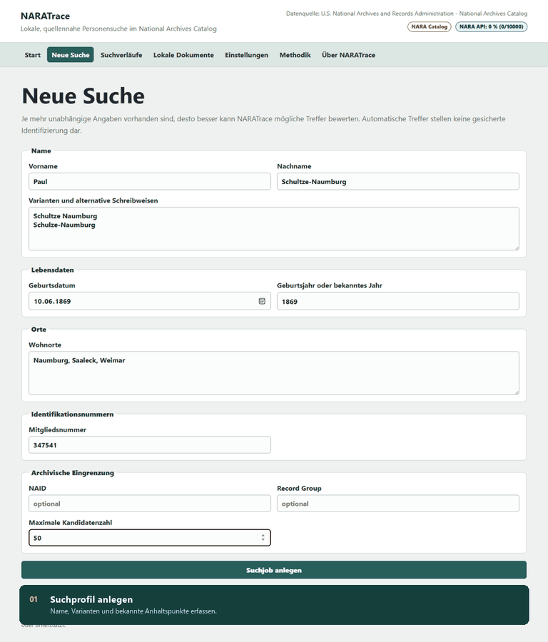
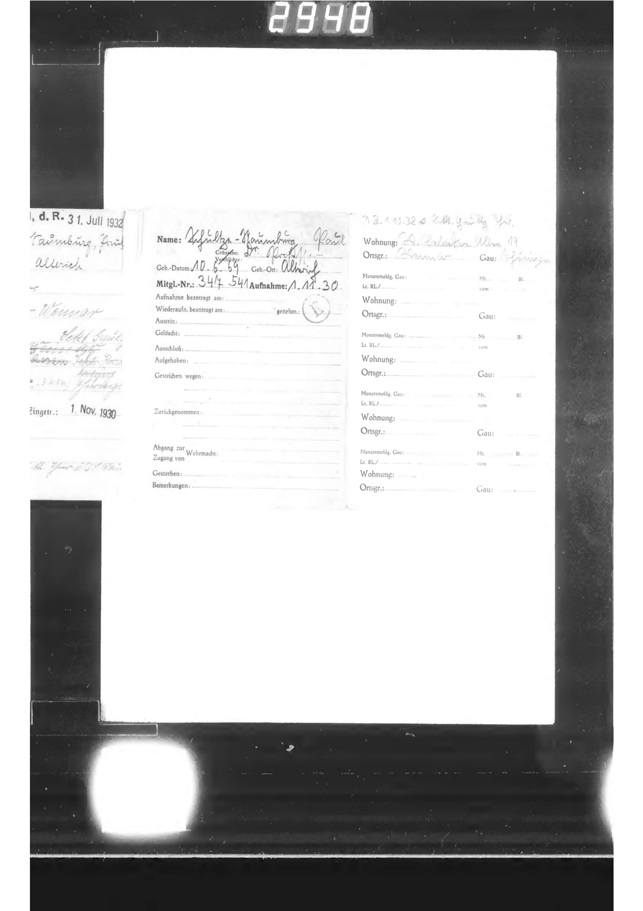
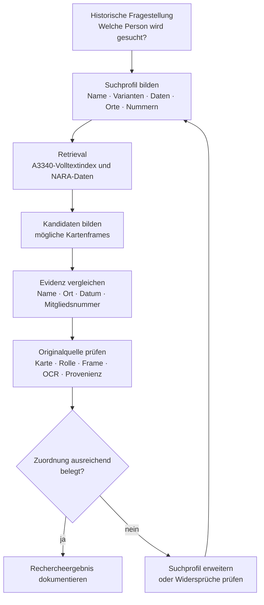
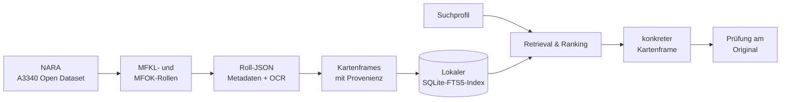

# NARATrace

> **Vom Namen zum überprüfbaren Kartenframe.**
> NARATrace unterstützt die Recherche in digitalisierten NSDAP-Mitgliederunterlagen der U.S. National Archives – vom ersten Namenshinweis bis zur Prüfung am Original.


https://github.com/user-attachments/assets/60d13918-8b2c-413a-93c0-5a7083d261a9


<p align="center">
  <strong>Lokale A3340-Recherche</strong> ·
  <strong>NARA-Provenienz pro Frame</strong> ·
  <strong>SQLite-Volltextindex</strong> ·
  <strong>Kartenpaar-Ansicht</strong>
</p>

NARATrace ist ein lokales Forschungswerkzeug für die Suche nach Personen in digitalisierten Beständen des **National Archives Catalog** der U.S. National Archives and Records Administration (NARA).

Im Mittelpunkt steht nicht nur die Frage, **ob ein Name gefunden wird**, sondern auch, **woher ein Treffer stammt und wie er überprüft werden kann**. Treffer bleiben deshalb mit Mikrofilmrolle, Frame, NAID, Objektdatei, OCR-Text und Originalquelle verbunden.

Die Anwendung läuft vollständig lokal. Es gibt kein Cloud-Backend und keine Telemetrie.

> [!IMPORTANT]
> Ein automatisch gefundener Treffer ist zunächst ein **Recherchehinweis**.
> Die Rangstärke bestimmt, welche Karte zuerst geprüft werden sollte. Sie ist **keine Wahrscheinlichkeit dafür, dass eine Person eindeutig identifiziert wurde**.

---

## Von der Suche zur Karte

Der typische Rechercheweg ist bewusst kurz gehalten:



1. **Suchprofil anlegen**
   Name, Namensvarianten, Lebensdaten, Orte oder Mitgliedsnummer eingeben.

2. **Recherche starten**
   NARATrace durchsucht den lokalen A3340-Index und weitere verfügbare NARA-Informationen.

3. **Kandidaten vergleichen**
   Treffer werden anhand der vorhandenen Evidenz geordnet.

4. **Karte prüfen**
   Der konkrete Kartenframe wird zusammen mit OCR, Provenienz und Originalquelle angezeigt.

5. **Recherche dokumentieren**
   Suchprofil, Treffer und Evidenz können anschließend als Recherchebericht exportiert werden.

---

## Beispiel: Paul Schultze-Naumburg

<p align="center">
  
</p>

Bei einem Treffer speichert NARATrace nicht nur einen erkannten Namen. Zur Fundstelle gehören unter anderem:

* Mikrofilmrolle,
* Frame,
* NAID,
* NARA-Objektdatei,
* NARA-URL,
* vorhandener OCR-Text und
* die beim Suchlauf verwendete Evidenz.

Damit lässt sich nachvollziehen, **welche Information aus welcher Quelle stammt**.

Zusammengehörige Scans können zusätzlich als **Kartenpaar** gelesen werden. Vorderseiten, Rückseiten und Fortsetzungen bleiben dadurch im Zusammenhang sichtbar.

---

# Wissenschaftlicher Rechercheprozess

Eine historische Personensuche endet nicht mit einem guten Suchtreffer. Zwischen einer Namensübereinstimmung und einer belastbaren Identifizierung liegen mehrere Prüfschritte.

NARATrace versucht diesen Prozess technisch abzubilden, ohne die quellenkritische Entscheidung zu automatisieren.



Der entscheidende Punkt liegt zwischen **Kandidat** und **historischer Aussage**.

NARATrace kann Hinweise gewichten, Namen zusammenführen und Fundstellen sichtbar machen. Die eigentliche quellenkritische Bewertung bleibt jedoch Aufgabe der Forschenden.

Ein hoher Rang bedeutet deshalb lediglich:

> **Dieser Frame enthält im Vergleich zu den anderen Kandidaten besonders viele passende Hinweise und sollte zuerst geprüft werden.**

---

## Was NARATrace derzeit kann

| Bereich                       | Funktion                                                                                                            |
| ----------------------------- | ------------------------------------------------------------------------------------------------------------------- |
| **A3340-Volltextsuche**       | MFKL- und MFOK-Rollen werden aus den öffentlichen NARA-Rollendaten in einen lokalen SQLite-FTS5-Index übernommen.   |
| **Namenssuche**               | Suche nach Namen und Namensvarianten sowie tolerantere Suche bei OCR- und Schreibvarianten.                         |
| **Zusätzliche Evidenz**       | Lebensdaten, Orte und Mitgliedsnummern können zur Eingrenzung genutzt werden.                                       |
| **Nachvollziehbares Ranking** | Treffer werden anhand der verfügbaren Hinweise geordnet, ohne eine automatische Personenidentifizierung vorzugeben. |
| **Frame-Provenienz**          | Rolle, Frame, NAID, Objektdatei und NARA-Quelle bleiben am Treffer erhalten.                                        |
| **Originalansicht**           | Treffer führen zum konkreten Kartenframe statt nur zu einem übergeordneten Dokumentcontainer.                       |
| **Kartenpaar-Ansicht**        | Zusammengehörige Vorder- und Rückseiten können gemeinsam gelesen werden.                                            |
| **OCR-Prüfung**               | Erkannte Suchbegriffe können unmittelbar im Kartenbild nachvollzogen werden.                                        |
| **Suchverlauf**               | Abgeschlossene Suchläufe werden lokal gespeichert.                                                                  |
| **Rechercheexport**           | Ergebnisse können als PDF, HTML oder Markdown dokumentiert werden.                                                  |
| **Lokale Dokumente**          | Eigene PDF-, Bild- und TIFF-Dateien lassen sich separat untersuchen.                                                |

---

# Die Quellenbasis

NARATrace erzeugt keinen neuen historischen Quellenbestand.

Die Recherche basiert auf der von NARA digital bereitgestellten Mikrofilm-Publikation **A3340 – *Records Relating to Membership in the Nationalsozialistische Deutsche Arbeiterpartei (NSDAP), 1927–1945***.

Sie gehört zur **Record Group 242 – *National Archives Collection of Foreign Records Seized***.

Die zugrunde liegenden deutschen Unterlagen gelangten nach 1945 in alliierte Obhut. Das **Berlin Document Center** wurde eingerichtet, um beschlagnahmte deutsche Unterlagen unter anderem für Kriegsverbrechensverfahren und Entnazifizierungsverfahren zusammenzuführen und auszuwerten.

A3340 umfasst insbesondere zwei für die Personensuche relevante Karteien:

* **MFKL – Zentralkartei**
* **MFOK – Ortsgruppenkartei**

Die MFKL ist alphabetisch organisiert und bildet den zentralen Einstieg für viele Namensrecherchen. Die MFOK kann zusätzliche lokale beziehungsweise organisatorische Zusammenhänge liefern.

Weiterführende Informationen von NARA:

* [Record Group 242](https://www.archives.gov/research/guide-fed-records/groups/242.html)
* [Berlin Document Center / Captured German Records](https://www.archives.gov/research/captured-german-records/berlin-document-center.html)

---

# Vom NARA-Datensatz zum Suchergebnis

Für die eigentliche Suche werden nicht bei jeder Anfrage Millionen Bilddateien durchsucht.

Stattdessen erstellt NARATrace aus den öffentlich verfügbaren Rollendaten einen lokalen Suchindex.



Die Kartenbilder selbst müssen nicht vollständig lokal gespeichert werden. Für einen konkreten Treffer kann NARATrace die zugehörigen Medien bei NARA abrufen und mit dem lokalen Suchergebnis verbinden.

Dadurch bleibt die Trennung zwischen

**lokalem Suchindex**

und

**archivischem Original**

erhalten.

---

# Arbeiten mit einem Treffer

Nach einem abgeschlossenen Suchlauf führt NARATrace in den lokalen Suchverlauf.

Dort beginnt die eigentliche Prüfung.

### 1. Rangfolge lesen

Die Rangstärke ordnet Kandidaten innerhalb des jeweiligen Suchlaufs.

Sie ist bewusst **keine Identitätswahrscheinlichkeit** und erreicht deshalb auch nicht einfach „100 %“.

### 2. Karte im Zusammenhang betrachten

In der Rohansicht kann ein einzelner Frame mit Zoom und OCR-Markierungen untersucht werden.

Die **Kartenpaar-Ansicht** ordnet zusammengehörige Scans so an, dass Vorderseiten, Rückseiten und mögliche Fortsetzungen gemeinsam gelesen werden können.

### 3. Gefundene Attribute nachvollziehen

Unter **Gesucht und gefunden** lässt sich prüfen, auf welchem Frame ein Name, eine Nummer oder ein anderes Suchmerkmal erkannt wurde.

Die entsprechende OCR-Fundstelle wird in der Kartenansicht hervorgehoben.

### 4. Widersprüche beachten

Ein ähnlicher Name reicht nicht für eine Identifizierung.

Besonders relevant sind deshalb auch Informationen, die **gegen** eine Zuordnung sprechen – beispielsweise abweichende Geburtsdaten, Orte oder Mitgliedsnummern.

---

# Arbeitsansichten

## Neue Suche

Das Suchformular nimmt neben dem Namen zusätzliche Hinweise auf:

* Namensvarianten,
* Lebensdaten,
* Orte,
* Mitgliedsnummern und
* archivische Eingrenzungen.

Suchjobs laufen im Hintergrund und zeigen ihren aktuellen Fortschritt.


---

## Lokale Dokumente

Neben NARA-Daten können auch eigene PDF-, Bild- und TIFF-Dateien untersucht werden.

NARATrace erstellt dafür eine lokale Vorschau, führt OCR aus und kann relevante Begriffe im Dokument hervorheben.

Diese Dokumente bleiben von den NARA-Treffern getrennt.


---

## Methodik

Ein eigener Methodikbereich erläutert den Weg vom Suchprofil über Retrieval und Ranking bis zur Prüfung des Originals.


---

# Installation

Dieser Teil richtet sich an Personen, die NARATrace lokal installieren oder weiterentwickeln möchten.

## Voraussetzungen

* Python 3.11 oder neuer
* Node.js 22 oder neuer
* Tesseract OCR für lokale OCR-Funktionen

### Backend installieren

```powershell
python -m pip install -e .\backend[test]
```

### Frontend installieren und bauen

```powershell
cd frontend
npm install
npm run build
cd ..
```

### NARATrace starten

```powershell
python -m naratrace
```

Standardmäßig läuft die Anwendung ausschließlich lokal unter:

```text
127.0.0.1:8765
```

Falls dieser Port bereits verwendet wird:

```powershell
python -m naratrace --port 8766
```

Ohne automatischen Browserstart:

```powershell
python -m naratrace --no-browser
```

---

# Windows-Schnellstart

Für Windows steht ein Quickstart-Skript bereit:

```powershell
.\quickstart.bat
```

Das Skript baut das Frontend und startet anschließend NARATrace.

Ist die vorgesehene lokale Instanz bereits aktiv, wird diese geöffnet. Ist der Port durch einen anderen Dienst belegt, sucht das Skript einen freien lokalen Port.

---

## A3340 erstmals indexieren

Für die vollständige Recherche über A3340 muss der lokale Index einmal aufgebaut werden:

```powershell
.\quickstart.bat index
```

Der Vorgang ist fortsetzbar. Bereits vollständig verarbeitete Rollen müssen bei einem späteren Lauf nicht erneut aufgebaut werden.

Indexieren und anschließend starten:

```powershell
.\quickstart.bat all
```

Der lokale Index enthält die Texte und Provenienzinformationen der MFKL- und MFOK-Rollen, aber **keine vollständige lokale Kopie aller Kartenbilder**.

---

# Was beim Indexaufbau passiert

Eine **Roll** entspricht einer digitalisierten Mikrofilmrolle.

NARATrace liest die von NARA bereitgestellten Beschreibungen dieser Rollen und übernimmt relevante Texte und Frame-Informationen in einen lokalen SQLite-Index.

Dabei bleibt für jeden Datensatz nachvollziehbar, aus welcher Rolle und welchem Frame er stammt.

Die eigentlichen Kartenbilder werden erst benötigt, wenn ein konkreter Treffer untersucht werden soll.

---

## Indexgeschwindigkeit

Der erste Aufbau des A3340-Indexes benötigt zahlreiche Netzwerkabrufe.

NARATrace verwendet dafür standardmäßig **16 parallele Abrufe** mit wiederverwendeten HTTP-Verbindungen. Die Schreibzugriffe auf SQLite bleiben davon getrennt kontrolliert.

Bei einer stabilen Verbindung kann die Parallelität erhöht werden:

```powershell
python -m naratrace --index-a3340 --a3340-concurrency 24
```

Alternativ:

```env
NARATRACE_A3340_INDEX_CONCURRENCY=24
```

Der vorgesehene Höchstwert liegt bei 32.

Bei wiederholten Timeouts oder Rate-Limit-Warnungen sollte die Parallelität wieder reduziert werden.

---

# A3340-Index auf einen anderen Rechner übertragen

Der einmal aufgebaute Index lässt sich beispielsweise über einen USB-Stick auf einen anderen Rechner übertragen.

Benötigt wird:

```text
nsdap-frames.sqlite3
```

Unter Windows befindet sich die Datei standardmäßig unter:

```text
%LOCALAPPDATA%\NARATrace\cache\nsdap\nsdap-frames.sqlite3
```

Da `%LOCALAPPDATA%` benutzerabhängig ist, kann der tatsächliche Pfad auf verschiedenen Rechnern unterschiedlich sein.

Alternativ lässt sich ein eigener Datenpfad konfigurieren:

```env
NARATRACE_DATA_DIR=D:\NARATrace-Daten
```

Der Index liegt dann unter:

```text
D:\NARATrace-Daten\cache\nsdap\nsdap-frames.sqlite3
```

NARATrace sollte während des Kopierens beendet sein.

Bei Änderungen am Indexformat kann ein erneuter Indexaufbau erforderlich werden.

---

# Offizieller AWS-Bulkzugang

NARA stellt A3340 zusätzlich über einen öffentlichen AWS-Bucket bereit:

```text
s3://nara-nsdap
```

Region:

```text
us-east-2
```

Für normale NARATrace-Recherchen ist eine vollständige lokale Kopie des Bestands nicht erforderlich.

Wer dennoch einen eigenständigen lokalen Rohdatenbestand aufbauen möchte, kann das dafür vorgesehene PowerShell-Skript verwenden.

Nur Metadaten:

```powershell
.\scripts\bulk-nsdap.ps1 -Destination D:\NARATrace-NSDAP -Mode Metadata
```

Für den vollständigen Datenbestand einschließlich großer Mediendateien ist eine zusätzliche explizite Bestätigung notwendig:

```powershell
.\scripts\bulk-nsdap.ps1 -Destination E:\NARATrace-NSDAP-vollbestand -Mode FullDataset -ConfirmFullDataset
```

Hierfür wird die AWS CLI v2 benötigt.

---

# NARA API

NARATrace kann zusätzlich die **National Archives Catalog API v2** verwenden.

Dokumentation:

```text
https://catalog.archives.gov/api/v2/api-docs/
```

Nach Angaben von NARA kann ein API-Schlüssel über folgende Adresse angefordert werden:

```text
Catalog_API@nara.gov
```

Der persönliche API-Schlüssel wird lokal im Betriebssystem-Keyring gespeichert.

```text
Service: NARATrace
Account: nara-api-key
```

Für Entwicklungsumgebungen kann alternativ verwendet werden:

```env
NARA_API_KEY=...
```

Der Schlüssel darf nicht in

* SQLite-Datenbanken,
* Browser Local Storage,
* Frontend-Code,
* Logs,
* Tests,
* Git-Commits oder
* Rechercheexporten

gespeichert werden.

---

# Lokale Daten

NARATrace speichert Forschungs- und Anwendungsdaten nicht im Repository.

Unter Windows wird standardmäßig das lokale Anwendungsverzeichnis verwendet:

```text
%LOCALAPPDATA%\NARATrace\
```

Dort können unter anderem folgende Verzeichnisse entstehen:

```text
database/
cache/
documents/
thumbnails/
ocr/
exports/
logs/
temp/
```

Für Entwicklung und Tests kann der Datenpfad überschrieben werden:

```env
NARATRACE_DATA_DIR=D:\mein-pfad
```

---

# Frontend und TextMarker

Das Frontend wird mit TypeScript entwickelt und entsprechend geprüft.

```powershell
cd frontend
npm run check
```

Für die interaktive Text- und Transkriptansicht verwendet NARATrace die Web-Component-APIs von

* `TS_TextMarkerCore`
* `TS_TextMarkerViewer`

Im aktuellen Entwicklungssetup werden beide als lokale `file:`-Abhängigkeiten eingebunden.

Die Schwester-Repositories sollten deshalb neben `NARA-Trace` liegen.

Der Viewer kann anschließend gebaut werden:

```powershell
cd ..\TS_TextMarkerViewer
just build

cd ..\NARA-Trace\frontend
npm install
```

Die größere PDF-Komponente wird erst geladen, wenn sie tatsächlich benötigt wird.

Die TextMarker-Komponenten ergänzen die Originalansicht. Sie verändern weder den archivischen Ursprung eines Treffers noch dessen OCR- oder Provenienzinformationen.

---

# Dokumentation

Je nach Interesse sind unterschiedliche Dokumente sinnvoll:

### Nutzung

[Nutzeranleitung](docs/USER-GUIDE.md)

### Suchverfahren und Bewertung

[Suchmethodik](docs/SEARCH-METHODOLOGY.md)

### Archivbestand und Datenstruktur

[NARA- und A3340-Datenarchitektur](docs/NARA_Architekture.md)

### Softwarearchitektur

[TRAXER-Programmarchitektur](docs/TRAXER_Architekture.md)

### Attribution und NARA-Bezug

[NARA-Attribution](docs/NARA-ATTRIBUTION.md)

---

# Tests

Gesamtes Projekt:

```powershell
.\scripts\test.ps1
```

Backend:

```powershell
python -m pytest .\backend\tests
```

Frontend:

```powershell
cd frontend
npm run test -- --run
```

---

# Methodische Grenzen

NARATrace soll historische Recherche **unterstützen**, nicht historische Identitäten automatisch feststellen.

OCR kann fehlerhaft sein. Namen können mehrfach vorkommen. Schreibweisen verändern sich. Scans können schwer lesbar sein und Metadaten können unvollständig sein.

Deshalb kombiniert die Suche unterschiedliche Hinweise wie:

* Namen und Namensvarianten,
* Orte,
* Lebensdaten,
* Mitgliedsnummern,
* archivische Metadaten,
* NARA Extracted Text und
* lokale OCR.

Mehrere übereinstimmende und voneinander unabhängige Merkmale können einen Treffer stärker machen. Sie ersetzen jedoch nicht die Prüfung des Originals.

Für wissenschaftliche Arbeiten sollten daher mindestens

**Karte → Frame → Rolle → archivischer Kontext → NARA-Nachweis**

nachvollzogen werden.

Die Originalquelle bleibt die Grundlage der historischen Aussage.

---

## Projektstatus

NARATrace ist ein **unabhängiges und inoffizielles Forschungswerkzeug**.

Das Projekt steht nicht in Verbindung mit der U.S. National Archives and Records Administration und wird von NARA weder betrieben noch unterstützt.

Archivische Metadaten, Rechteinformationen und Zitierweisen sollten für eine wissenschaftliche Verwendung immer am jeweiligen Originaldatensatz überprüft werden.
