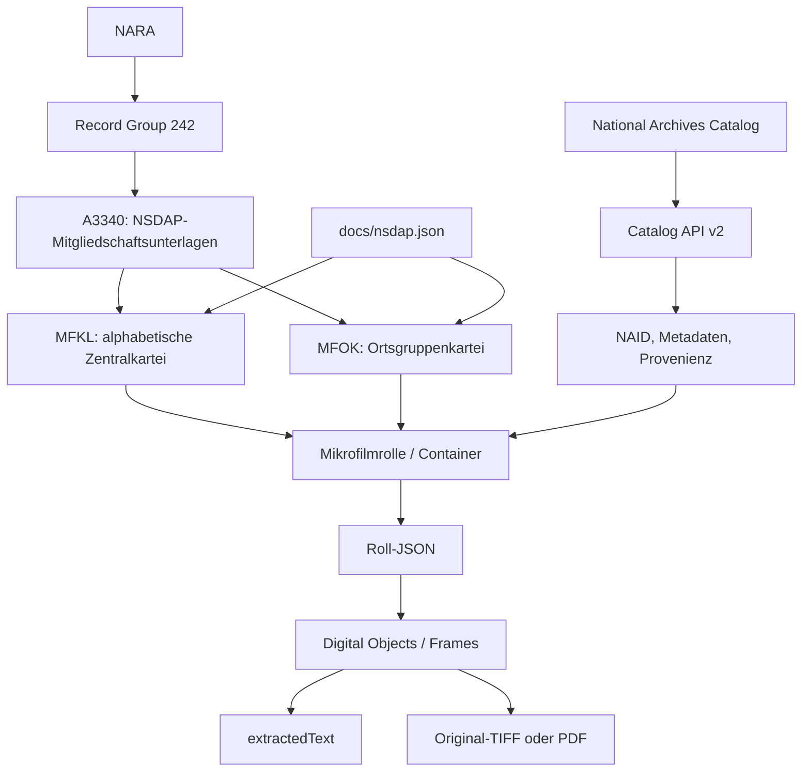

# NARA- und A3340-Datenarchitektur

Stand: 2026-09-20. Dieses Dokument beschreibt die externe, offizielle Datenwelt. Die Architektur von NARATrace selbst steht in [TRAXER_Architekture.md](TRAXER_Architekture.md).

## Archivische Struktur

NARA bewahrt in Record Group 242 die *National Archives Collection of Foreign Records Seized*. Die Serie **Records Relating to Membership in the Nationalsozialistische Deutsche Arbeiterpartei (NSDAP), 1927–1945** trägt die Mikrofilm-Publikationsnummer **A3340** und die Serien-NAID **12044361**.

Für die Personensuche sind zwei veröffentlichte Teile entscheidend:

- **MFKL**, die Zentralkartei, ist die alphabetische Mitgliedskartei der zentralen NSDAP-Verwaltung. Sie ist der primäre Weg für Namensrecherche.
- **MFOK**, die Ortsgruppenkartei, ist eine zentrale geographische Kartei. Sie kann ortsbezogene, unabhängige Evidenz liefern und wird getrennt bewertet.

Eine Mikrofilmrolle (im Manifest `box`, etwa `R0014`) ist ein archivischer Container mit einem Namen- oder Ortsbereich. Diese Ordnung ist Suchwissen: ein Name wird zuerst gegen Bereichsgrenzen verglichen, bevor sein OCR-Text in einer kleinen Rollenauswahl gesucht wird. Eine blinde Suche über alle mehr als 14 Millionen Digitalobjekte wäre teurer, schwer nachvollziehbar und bei OCR-Fehlern besonders rauschbehaftet.



## Technische Struktur des Open Dataset

NARA veröffentlicht das Dataset im öffentlichen S3-Bucket `nara-nsdap` und beschreibt den Zugriff im offiziellen Repository [`usnationalarchives/nsdap`](https://github.com/usnationalarchives/nsdap). Das offizielle Manifest `docs/nsdap.json` enthält pro Rolle die Felder: `id` (NAID), `agency` (MFKL/MFOK), `box`, `title` und `s3`.

```text
docs/nsdap.json
  -> Rollenbeschreibung (agency, box, title, NAID, s3)
  -> s3://nara-nsdap/<Rollenpfad>/<NAID>.json
  -> record.digitalObjects[]
  -> objectFilename + extractedText + objectUrl
  -> Original-TIFF bzw. rollenweises PDF
```

Ein Roll-JSON spiegelt einen Catalog-Datensatz: `record.naId` bezeichnet die Rolle, `record.digitalObjects` ihre Frames. `objectFilename` verknüpft OCR und Bild, `extractedText` ist die von NARA bereitgestellte Textract-OCR. Das Originalbild bleibt maßgeblich; OCR ist ein Such- und Prüfhinweis.

Beispiel einer aktuell geprüften Manifestbeobachtung: `MFKL R0014` hat NAID `593495034`, Titel `Schultze, Paul - Schultze, Robert` und einen S3-Pfad unter `A3340-MFKL/A3340-MFKL-R0014`. Das ist kein Produktions-Sonderfall, sondern ein normales Ergebnis der Bereichsauswahl.

## Catalog API und A3340 Open Dataset

| Quelle | Einsatz in NARATrace | Nicht ihr Ersatz |
| --- | --- | --- |
| National Archives Catalog API v2 | Archivmetadaten, NAID, Rechte, öffentliche Catalog-URL, Serienkontext und Fallback-Suche | rollenpräzise Volltextsuche über A3340 |
| A3340 Open Dataset | Rollenindex, Roll-JSON, Frames, `extractedText`, `objectFilename`, Originalobjekt-URLs | Identitätsentscheidung oder manuelle Quellenkritik |

Die Catalog API ist schlüsselgeschützt und darf nicht für Corpus-Scraping missbraucht werden. Das Open Dataset ist für die gezielte Rollennutzung vorgesehen. NARATrace verwendet daher erst den lokalen Rollenindex und nur ergänzend den Catalog als Metadaten- und Fallback-Weg.

## Quellen und Grenzen

- [NARA: offizielles NSDAP-Repository](https://github.com/usnationalarchives/nsdap)
- [NARA: A3340, NAID 12044361](https://catalog.archives.gov/id/12044361)
- [NARA: Captured German Records / Berlin Document Center](https://www.archives.gov/research/captured-german-records/berlin-document-center.html)
- [NARA Catalog API](https://catalog.archives.gov/api/v2/api-docs/)

Die Feld- und Pfadbeschreibung wurde gegen Manifest und Roll-JSON am 2026-09-20 geprüft. NARA kann Dataset-Struktur oder OCR künftig aktualisieren; Cache-Inhalte sind daher mit Abrufdatum und Original-URL zu behandeln.
