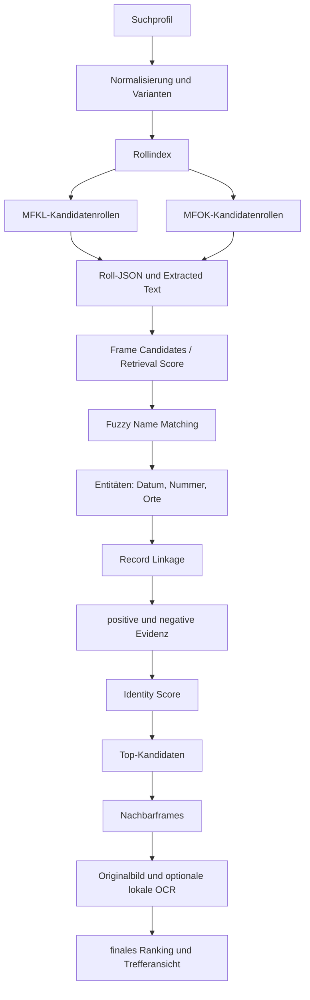

# Suchmethodik

NARATrace erzeugt keine gesicherten Identifizierungen. Die Pipeline trennt die Frage „welche Frames soll ich ansehen?“ von „welcher Frame gehört wahrscheinlich zu dieser Person?“. Dadurch wird ein zufälliger Volltexttreffer nicht zur scheinbar sicheren Identität.

## Retrieval

Die A3340-Pipeline verwendet getrennte, dokumentierte Pässe: vollständiger Name, normalisierte Namensform, Nachname plus Vorname, fuzzy Nachname, Nachname plus Geburtsjahr, Nachname plus Ort, Mitgliedsnummer und erst danach Catalog-Fallback. Ergebnisse behalten ihren Retrieval-Pass. MFKL-Retrieval ist bereits in den Suchjob eingebunden: Nur konkrete Frames werden als Treffer gespeichert und höchstens drei davon als einzelne Originalbilder geladen – nie ein komplettes Rollen-PDF.

Namensnormalisierung bewahrt stets den Originalwert. Bindestrich-, Leerzeichen-, Umlaut-, ß- und Adelsprädikatvarianten sind gewichtet; ein kurzer Namensstamm ist nie gleich stark wie ein vollständiger Doppelname. Fuzzy-Matching darf Kandidaten retten, nicht häufige Namen zu Beweisen machen.

## Evidenz und Ranking

Ein zukünftiger Retrieval Score priorisiert Frames nach Text- und Namenssignalen. Ein separater Identity Score verbindet nur danach unabhängige Merkmale:

- Namen und Varianten;
- Geburtsdatum/-jahr;
- robuste Mitgliedsnummern;
- Ortsarten wie Geburts-, Wohn- und Ortsgruppenort;
- Quellenkontext, Nachbarframes und OCR-Herkunft.

Widersprüchliche Daten sind negative Evidenz und müssen sichtbar bleiben. Mitgliedsnummern sind besonders stark, aber nur nach feldnaher Extraktion: das Zusammenziehen aller Ziffern eines gesamten OCR-Textes ist unzulässig.

## Prüfung und Grenzen

Nutzer prüfen Originalseite, Transkript, Evidenzliste, Rolle, Frame, `objectFilename`, NAID und NARA-URL. OCR kann Namen und Zahlen verfehlen; fehlende Treffer beweisen kein Fehlen der Quelle. Lokale OCR und manuelle Transkriptkorrektur ergänzen NARA Extracted Text, ersetzen aber niemals dessen Provenienz. Siehe auch [NARA_Architekture.md](NARA_Architekture.md) und [TRAXER_Architekture.md](TRAXER_Architekture.md).
