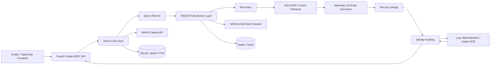

# TRAXER-Programmarchitektur

Stand: 2026-09-20. Dieses Dokument beschreibt die lokale Anwendung; die externe NARA-Struktur steht in [NARA_Architekture.md](NARA_Architekture.md).

## Schichten und Datenfluss



Der angestrebte Datenfluss lautet:

```text
SearchRequest -> SearchProfile -> Query Planner -> Roll Candidates
-> Frame Candidates -> Extracted Entities -> Match Evidence
-> Person Candidate -> Ranked SearchResult -> Frontend
```

## Module und Grenzen

| Modul | Verantwortlich für | Nicht verantwortlich für |
| --- | --- | --- |
| `naratrace.api` | lokale REST-Validierung, Antworten, Medienzugriff | Suchlogik oder Rangentscheidung |
| `naratrace.processing` | Job-Lebenszyklus, Persistenz-Orchestrierung, Abbruch | NARA-spezifische Bereichslogik |
| `naratrace.nara` | Catalog API v2, API-Key, Rate-Limit- und Fehlerbehandlung | A3340-Corpusindex |
| `naratrace.nsdap` | Manifest, Rollenauswahl, S3-Roll-JSON, Frame-Provenienz, Cache | Identitätsranking, UI, Annotation |
| `naratrace.matching` | Name/Ort/Nummer-Normalisierung, Fuzzy-Merkmale, Evidenz und Ranking | Originaldatei-Download |
| `naratrace.ocr` | austauschbare lokale OCR-Provider | Zugriff auf Cloud-OCR als Pflichtweg |
| `naratrace.database` | SQLite-Modelle, Cache-Metadaten, Suchverläufe | fachliches Matching |
| `naratrace.export` | lokale, quellennahe Berichte | erneute Suche oder Korrekturentscheidung |

Bereits umgesetzt sind die lokale FastAPI/Svelte-Anwendung, SQLite-Suchjobs, Catalog-Client, Ergebnis- und Transkriptansicht, manuelle Korrekturen sowie die getrennte `naratrace.nsdap`-Schicht: Manifestparser/-cache, bereichsbasierte Rollenauswahl, Roll-JSON-Lader, Frame-Provenienz und retrieval-orientierte Frame-Suche. Der Search Job nutzt MFKL nun zuerst und speichert ausschließlich einzelne Kartenframes; der Catalog bleibt der Fallback. Die neue Entity-/Identity-Ranking-Schicht ist noch offen.

## Speicherarchitektur

Alle Nutzdaten bleiben im per `platformdirs` bestimmten lokalen Datenordner.

- SQLite: Jobs, Suchprofile, Kandidaten, Evidenzen, Ergebnisse und manuelle Transkriptkorrekturen.
- `cache/nsdap/`: Manifest und gezielt geladene Roll-JSONs; nie als Bestätigung einer Identität behandeln.
- `documents/`, `thumbnails/`, `ocr/`: nur nachrangig materialisierte Originalbilder, browserfähige Ableitungen und lokale OCR-Artefakte.
- `exports/`: lokale Rechercheberichte.
- Keyring: NARA-Catalog-API-Key, nicht SQLite oder Frontend.

FTS5 ist vorgesehen, sobald Roll-JSONs lokal dauerhaft indexiert werden. Bis dahin wird keine komplette A3340-Kopie stillschweigend heruntergeladen.

## Architekturentscheidungen

1. **Open Dataset vor Catalog-only Retrieval:** Das Dataset liefert die Roll- und Frame-Ebene, auf der die Karte tatsächlich liegt; der Catalog liefert weiterhin die archivische Referenz.
2. **Rollenvorselektion:** Bereichstitel begrenzen Abruf und erklären, warum ein Rollenkandidat untersucht wurde. Direkte Nachbarrollen fangen Grenzen und Schreibvarianten ab.
3. **Retrieval und Identität getrennt:** Ein OCR-Frame kann ein guter Suchkandidat sein, ohne dieselbe Person zu belegen. Erst unabhängige, auch negative Evidenz bestimmt den Identity Score.
4. **Lazy Images/OCR:** Nur die drei höchstgerankten Frames erhalten ein Originalbild. NARA Extracted Text wird zunächst übernommen; lokale OCR ist eine spätere Nachprüfung. Das vermeidet Mehrfachdownloads großer Rollen.
5. **MFKL/MFOK getrennt:** Die Karteien haben verschiedene Archivfunktionen; ihre Treffer werden als unabhängige Evidenz verknüpft, nicht vermischt.

Eine spätere TS_TextMarker-Integration bleibt optional: ein Adapter kann Fundstellen semantisch markieren und Korrekturen zurück in die bestehende lokale Annotation schreiben. Die Suchpipeline hängt nicht davon ab.
